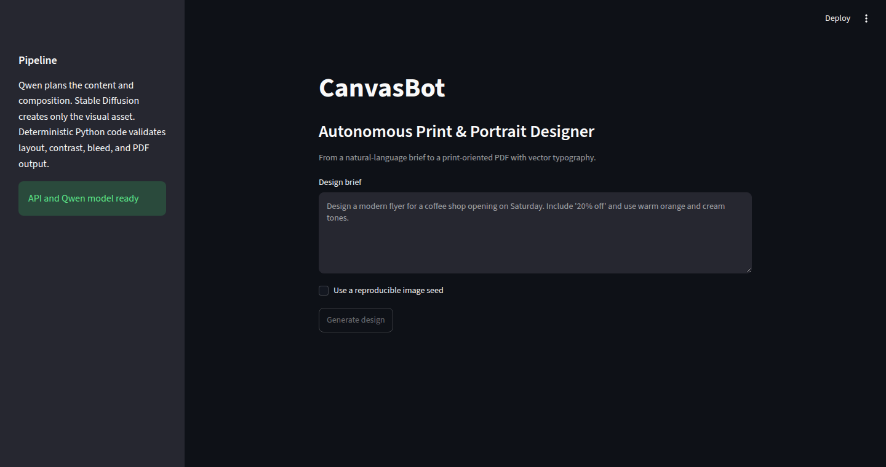
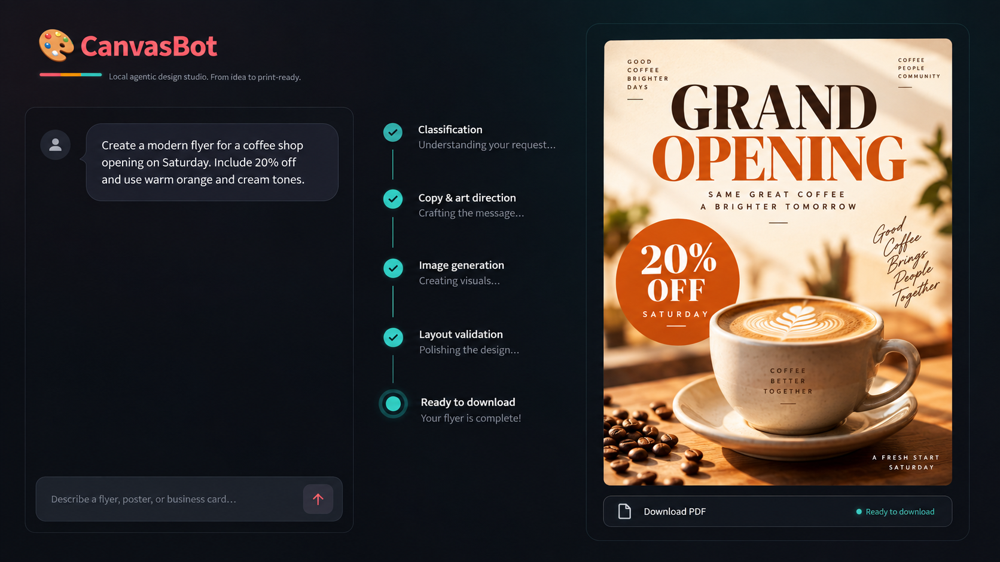
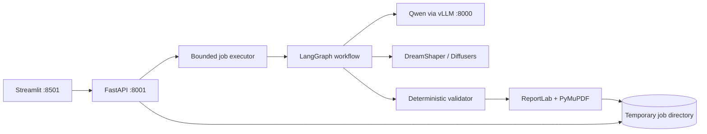

# CanvasBot: Autonomous Print & Portrait Designer

[](https://github.com/ecampbelldsp/CanvasBot/actions/workflows/quality.yml)

CanvasBot is an autonomous, production-oriented design workflow that turns a natural-language
brief into a print-oriented flyer, poster, or business card. It deliberately separates creative
reasoning from deterministic rendering: Qwen produces validated creative decisions, Stable
Diffusion creates raster artwork—including portraits requested in the brief—and Python places
vector text into a bleed-sized PDF.

The repository keeps the original notebooks as an experimentation history while exposing the
validated approach through a versioned FastAPI service and a Streamlit client.



_The production interface submits asynchronous design jobs and reports the active workflow stage.
The API defaults to one result per job to keep latency and GPU pressure predictable on the target
6 GB card._



_Example workflow: a natural-language coffee-shop brief progresses through classification, creative
direction, image generation, layout validation, and a downloadable flyer result._

> **Scope:** the output has vector typography, physical dimensions, safe zones, and bleed. It is
> not yet a press-certified PDF/X file: generated images are RGB and no printer-specific ICC
> profile or CMYK conversion is applied. A real print integration must add the target printer's
> color profile and preflight rules.

## What this project demonstrates

- LangGraph orchestration with separate classification, copywriting, image, layout, validation,
  and rendering stages.
- Pydantic constraints around every LLM-produced structure.
- An OpenAI-compatible local Qwen model served by vLLM.
- Lazy Stable Diffusion loading and a bounded background queue for a memory-constrained GPU.
- Deterministic glyph-width wrapping, safe-zone placement, WCAG contrast selection, and
  conditional algorithmic scrims.
- Temporary, per-request artifact isolation with UUID-only paths and expiry cleanup.
- Health/readiness endpoints, structured failure states, API documentation, static analysis,
  and tests that do not require a GPU or model download.

## Architecture



The API returns `202 Accepted` immediately. The single background worker performs GPU-heavy work
and updates a job record that the UI or another client can poll. One API process and one generation
worker are intentional on this deployment target: vLLM reserves 45% of the 6 GB GPU, and
the Diffusers pipeline uses sequential CPU offload.

## Repository layout

```text
src/canvasbot/          Production package
  api.py             FastAPI application and health endpoints
  workflow.py        LangGraph orchestration
  llm.py             Qwen/vLLM structured-output adapter
  image_generation.py  Lazy Diffusers adapter
  layout.py          Deterministic typography and contrast rules
  rendering.py       PDF and preview rendering
  jobs.py            Bounded queue and temporary artifact lifecycle
app.py               Streamlit entry point
main.py              ASGI compatibility entry point
config/              Existing vLLM configuration
notebooks/           Concept experiments and iteration history
tests/               GPU-independent automated tests
deploy/systemd/      Example single-machine production services
```

## Prerequisites

- Linux with an NVIDIA GPU and a working NVIDIA driver.
- Python 3.12 or 3.13.
- [`uv`](https://docs.astral.sh/uv/) for locked dependency management.
- The Qwen service already running with the repository configuration:

```bash
vllm serve --config config/server_vllm_config.yaml
```

The checked configuration serves `Qwen/Qwen2.5-3B-Instruct-AWQ` at
`http://127.0.0.1:8000/v1`. The application defaults match those exact values. Keep vLLM in a
separate virtual environment from this application so dependency upgrades cannot destabilize the
inference server. Activate that environment before launching vLLM so helper executables such as
`ninja` are available on `PATH`.

## Local installation

Create a dedicated application environment without touching the environment used by vLLM:

```bash
UV_PROJECT_ENVIRONMENT=.venv-app uv sync --locked --extra generation --extra notebooks
cp .env.example .env
```

The first design downloads `Lykon/dreamshaper-8`, the LCM-LoRA acceleration weights, and, when
background removal is needed, the `u2net` model. Subsequent requests reuse the local caches. Make
sure the machine has enough disk space before the first run.

Start the API in terminal two:

```bash
.venv-app/bin/canvasbot-api
```

Start the UI in terminal three:

```bash
.venv-app/bin/streamlit run app.py --server.address 127.0.0.1 --server.port 8501
```

Open `http://127.0.0.1:8501`. Interactive API documentation is at
`http://127.0.0.1:8001/docs`.

Verify both the API and the configured Qwen model:

```bash
curl --fail http://127.0.0.1:8001/health/live
curl --fail http://127.0.0.1:8001/health/ready
```

## API usage

Create a job:

```bash
curl --request POST http://127.0.0.1:8001/v1/designs \
  --header 'Content-Type: application/json' \
  --data '{
    "prompt": "Design a modern flyer for a coffee shop opening on Saturday. Include 20% off and use warm orange and cream tones.",
    "seed": 42
  }'
```

The response contains a UUID and starts in `queued`. Poll it until it reaches `succeeded`,
`failed`, or `rejected`:

```bash
curl http://127.0.0.1:8001/v1/designs/<job-id>
curl --output design.pdf http://127.0.0.1:8001/v1/designs/<job-id>/pdf
curl --output preview.png http://127.0.0.1:8001/v1/designs/<job-id>/preview
```

Jobs live under `data/jobs/<uuid>/`, are excluded from Git, and expire after one hour by default.
Expired jobs are removed at application startup and when new work is submitted. Restarting the API
does not resume interrupted jobs because persistence was deliberately excluded from this version.

## Testing and quality checks

The test environment intentionally omits GPU-generation dependencies:

```bash
UV_PROJECT_ENVIRONMENT=.venv-test uv sync --locked --extra dev
UV_PROJECT_ENVIRONMENT=.venv-test uv run pytest --cov=canvasbot --cov-report=term-missing
UV_PROJECT_ENVIRONMENT=.venv-test uv run ruff check src tests app.py main.py
UV_PROJECT_ENVIRONMENT=.venv-test uv run ruff format --check src tests app.py main.py
UV_PROJECT_ENVIRONMENT=.venv-test uv run mypy src/canvasbot
```

The tests use fake LLM and image adapters. They exercise API job handling, routing, validation,
rendering, temporary artifacts, PDF geometry, text extraction, and error contracts without loading
Qwen or Stable Diffusion. A manual smoke test with both real models is still required after GPU
driver, CUDA, PyTorch, or model changes.

## Single-GPU production deployment

1. Create a non-login service account and place the repository at `/opt/canvasbot` (or edit the
   example units to match your location).
2. Install the application in `/opt/canvasbot/.venv-app` using the locked installation command above.
3. Copy `.env.example` to `/etc/canvasbot.env`, make it readable only by the service account, and
   review every value.
4. Keep the existing vLLM command supervised in its own terminal multiplexer or systemd service:

   ```bash
   vllm serve --config /opt/canvasbot/config/server_vllm_config.yaml
   ```

5. Install and start the provided API and UI units:

   ```bash
   sudo cp deploy/systemd/canvasbot-api.service /etc/systemd/system/
   sudo cp deploy/systemd/canvasbot-ui.service /etc/systemd/system/
   sudo systemctl daemon-reload
   sudo systemctl enable --now canvasbot-api canvasbot-ui
   sudo systemctl status canvasbot-api canvasbot-ui
   ```

The examples bind both applications to loopback. If the portfolio demo must be public, put a TLS
reverse proxy with authentication and request-size/rate limits in front of ports 8001 and 8501.
The application intentionally contains no user authentication and must not be exposed directly to
the internet.

Operational constraints for this host:

- Keep `CANVASBOT_MAX_CONCURRENT_GENERATIONS=1` and the Uvicorn worker count at one.
- Do not run multiple Streamlit/API copies that each load a Diffusers pipeline.
- Monitor both VRAM and system RAM; sequential CPU offload trades VRAM pressure for RAM and latency.
- Treat `/health/live` as process health and `/health/ready` as Qwen connectivity/model identity.
- Generated files are temporary. Do not place business-critical work only in `data/jobs`.

Useful service commands:

```bash
journalctl -u canvasbot-api -u canvasbot-ui --follow
sudo systemctl restart canvasbot-api canvasbot-ui
```

## Configuration

All settings use the `CANVASBOT_` prefix; see `.env.example`. The most important values are:

| Variable | Default | Purpose |
|---|---:|---|
| `CANVASBOT_VLLM_BASE_URL` | `http://127.0.0.1:8000/v1` | OpenAI-compatible vLLM endpoint |
| `CANVASBOT_VLLM_MODEL` | `Qwen/Qwen2.5-3B-Instruct-AWQ` | Exact served model identifier |
| `CANVASBOT_IMAGE_MODEL` | `Lykon/dreamshaper-8` | Diffusers image model |
| `CANVASBOT_LORA_MODEL` | `latent-consistency/lcm-lora-sdv1-5` | Low-step LCM acceleration weights |
| `CANVASBOT_API_PORT` | `8001` | FastAPI port; separate from vLLM |
| `CANVASBOT_JOB_TTL_SECONDS` | `3600` | Temporary artifact lifetime |
| `CANVASBOT_MAX_CONCURRENT_GENERATIONS` | `1` | GPU-heavy worker concurrency |
| `CANVASBOT_PREVIEW_DPI` | `150` | Browser preview resolution |

## Notebook workflow

Notebooks remain the place to test new prompts, agents, rendering rules, and visual ideas. Once an
experiment is stable, move the reusable behavior into `src/canvasbot/` and cover it with a deterministic
test. Production code must never import a notebook or rely on notebook execution order.

The main iterations are:

- `notebooks/poc.ipynb`: initial Pydantic and PDF-rendering exploration.
- `notebooks/multi_agent.ipynb`: early separation of copy and layout responsibilities.
- `notebooks/langgraph_system.ipynb`: first complete LangGraph workflow.
- `notebooks/langgraph_system_3.ipynb`: latest experimental contrast and layout work.

Downloaded fonts, model files, notebook outputs, generated designs, private research notes, and
runtime job folders are excluded by `.gitignore`. Only source notebooks and intentionally curated
documentation should be committed.

## Known next steps

- Printer-specific PDF/X generation, CMYK conversion, ICC profiles, crop marks, and automated
  preflight.
- Durable object storage and a distributed queue if the deployment moves beyond one GPU host.
- Authentication, quotas, abuse controls, prompt/content policy, and audit events before public use.
- Offline quality evaluation for copy fidelity, aesthetic preference, contrast pass rate, latency,
  rejection accuracy, and print-preflight success.

## License

MIT. See `LICENSE`.
